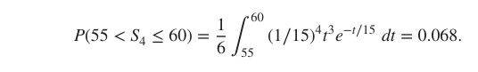
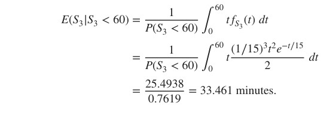
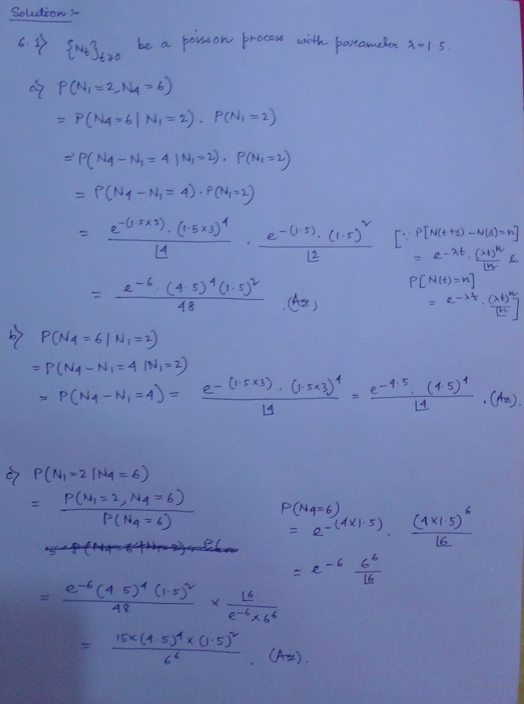
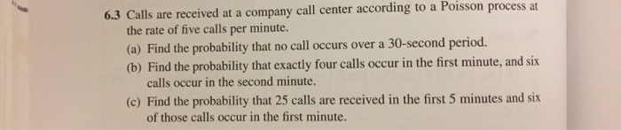
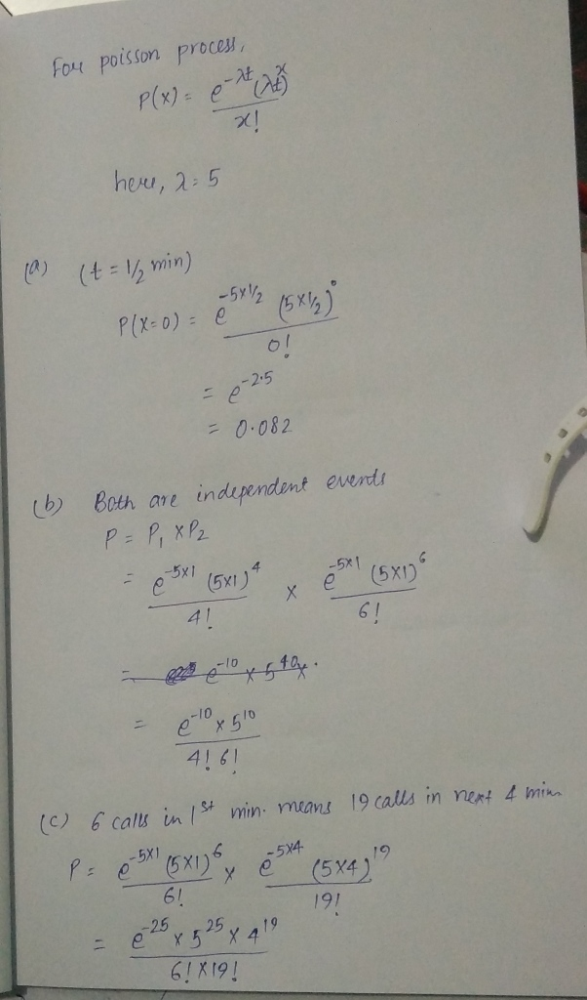

### Definicion

### Ejemplos

Starting at 6 a.m., customers arrive at Martha's bakery according to a
Poisson process at the rate of 30 customers per hour. Find the
probability that more than 65 customers arrive between 9 and 11 a.m.

```{r}
1-ppois(65,2*30)
```

Joe receives text messages starting at 10 a.m. at the rate of 10 texts
per hour according to a Poisson process. Find the probability that he
will receive exactly 18 texts by noon and 70 texts by 5 p.m.

The desired probability is P(N2 = 18, N7 = 70), with time as hours. If
18 texts arrive in [0, 2] and 70 texts arrive in [0, 7], then there are
70 − 18 = 52 texts in (2, 7]. That is, {N2 = 18, N7 = 70} = {N2 = 18, N7
− N2 = 52}.

The intervals [0, 2] and (2, 7] are disjoint, which gives P(N2 = 18, N7
= 70) = P(N2 = 18, N7 − N2 = 52) = P(N2 = 18) P(N7 − N2 = 52) = P(N2 =
18) P(N5 = 52)

= (e−2(10)(2(10))\*\* 18/18!) \* (e−5(10)(5(10))\*\* 52/52!)

where the second equality is because of independent increments, and the
third equal- ity is because of stationary increments. The inal
calculation in R is

**base el el promedio por hora, x,y es la multiplicacion de el primer
evento por la cantidad de tiempo transcurrida siendo m,n lo mismo pero
para el siguiente evento**

```{r}
poisson_multiplicado <- function(x,y,m,n,base){
  resultado <- 0
    resultado <- dpois(x,y*base)*dpois(m,n*base)
    return(resultado)
}

resultado0 <- poisson_multiplicado(18,2,52,5,10)
print(resultado0)

```
##### Proceso de Poisson traducido

On election day, people arrive at a voting center according to a Pois-
son process. On average, 100 voters arrive every hour. If 150 people
arrive during the irst hour, what is the probability that at most 350
people arrive before the third hour?

Let Nt denote the number of arrivals in the irst t hours. Then, (Nt)t≥0
is a Poisson process with parameter lambda = 100. Given N1 = 150, the
distribution of N3 − N1 = N3 − 150 is equal to the distribution of N2.
This gives

P(N3 ≤ 350\|N1 = 150) = P(N3 − 150 ≤ 200\|N1 = 150) = P(N2 ≤ 200)

**Esta formula se utliza cuando ocurre un resultado diferente de la
media y se espera un resultado posterior en el tiempo dado x=promedio ,
y=numero_de_eventos, z=esperado_acciones**

```{r}
poisson_acumulada <- function (x,y,z){
    resultado <- 0
    for(i in 0:z){
      resultado = resultado + dpois(i,x*y)
    }
    return(resultado)
}

resultado <- poisson_acumulada(100,2,200)
print(resultado)
```

#### ARRIVAL, INTERARRIVAL TIMES

Bus Waiting Times

```{r}
# buswaiting.R
trials <- 5000
amy <- numeric(trials)
zach <- numeric(trials)
for (i in 1:trials) {
  bus <- rexp(1,1/30)
  amy[i] <- bus
  while (bus < 10) { bus <- bus + rexp(1,1/30) }
  zach[i] <- bus-10 }
```

```{r}
mean(amy)

mean(zach)

hist(amy,xlab="Amy",prob=T,ylab="",main="")
hist(zach,xlab="Zach",prob=T,ylab="",main="")
```

Una estación de metro de Boston da servicio a las líneas roja, verde y naranja.
Los subterráneos de cada línea llegan a la estación de acuerdo con tres Poisson independientes.
procesos. En promedio, hay un tren rojo cada 10 minutos, un tren verde cada
15 minutos y un tren naranja cada 20 minutos.

i) Cuando llegue a la estación, ¿cuál es la probabilidad de que el primer metro que llega es por la linea verde?
ii)¿Cuánto tiempo esperará, en promedio, antes de que llegue algún tren?
iii)Ha estado esperando 20 minutos por un tren rojo y ha visto tres
pasan los trenes naranjas. ¿Cuál es el tiempo adicional esperado que esperará
tu metro?

i)
Sean XG, XR y XO, respectivamente, los tiempos de las primeras luces verde, roja y roja.
subterráneos naranjas que llegan a la estación. El evento de que el primer subterráneo es
verde es el evento de que XG es el mínimo de los tres aleatorios independientes
variables La probabilidad deseada es:

P(min(XG, XR, XO) = XG) = (1∕15) / (1∕10 + 1∕15 + 1∕20) = 4/13 = 0.31.

```{r}
datos <- c(10,15,20)
esperado <- 15
promedio <- 0
llegadas_esperadas <- function(datos,esperado){
  for( x in datos){
      promedio <-  promedio + (1/x) 
  }
  
  resultado <- (1/esperado)/promedio
  return(resultado)
}

resultado <- llegadas_esperadas(datos,esperado)
print(resultado)
```

```{r}
promedio_llegadas <- function(datos){
  promedio <- 0 
  for( x in datos){
      promedio <-  promedio + (1/x) 
      print((1/x))
  }
  return(promedio)
}

print(promedio_llegadas(datos))

tiempo_promedio <- function(){
  sim <- replicate(10000,min(rexp(1,1/10),rexp(1,1/15),rexp(1,1/20)))
  mean(sim)
}

```
```{r}
tiempo_promedio <- function(datos){
  sim <- replicate(10000,min(rexp(1,1/10),rexp(1,1/15),rexp(1,1/20)))
  o <- mean(sim)
  return(o)
}

segundo <- tiempo_promedio(datos)
print(segundo)
```
Su tiempo de espera es independiente de las llegadas naranjas. por falta de memoria de tiempos entre llegadas, el tiempo de espera adicional para la línea roja tiene el mismo distribución como el tiempo de espera original. Esperarás, en promedio, 10 más minutos.


--------------------------------------------------------------------------------------

Los momentos en que se marcan goles en hockey se modelan como un Poisson
proceso en Morrison (1976). Para tal proceso, suponga que el tiempo promedio entre
goles es de 15 minutos.

(i) En un juego de 60 minutos, encuentre la probabilidad de que ocurra un cuarto gol en los últimos 5
minutos del juego.

<center>

</center>

**Funcion para buscar las probabilidades de un evento dado tiempo promedio**
```{r}
pgammatiempo <- function(tiempo_total,minutos, lambda,valor_esperado){
  tiempo_final <- tiempo_total-minutos
  
  return(pgamma(tiempo_total,valor_esperado,lambda)-pgamma(tiempo_final,valor_esperado,lambda))
}

print(pgammatiempo(60,5,1/15,4))
```


(ii) Suponga que se marcan al menos tres goles en un partido. ¿cual es el tiempo medio
del tercer gol?

<center>

</center>

$$pendiente$$

Comenzando en el tiempo t = 0, los clientes llegan a un restaurante de acuerdo con un
Proceso Poisson con tasa 20 clientes por hora.
(i) Halle la probabilidad de que el cliente número 60 llegue en el intervalo [2.9, 3].


El tiempo de la llegada número 60 S60 tiene una distribución gamma con parámetros
n = 60 y  lambda= 20. La probabilidad deseada es P(2.9 < S60 < 3). En R, escriba
```{r}
pgamma(3,60,20)-pgamma(2.9,60,20)
```


(ii) Si 60 personas llegan al restaurante en el tiempo t = 3, encuentre la probabilidad de que el
El cliente número 60 llega en el intervalo [2.9, 3].


R: Simulating a Poisson Process on [0, t]
Following is a simulation of the arrival times of a Poisson process with parameter
lambda = 1∕2 on [0, 30].
##### poissonsim.R
```{r}
t <- 30
lambda <- 1/2
N <- rpois(1,lambda*t)
unifs <- runif(N,0,t)
arrivals <- sort(unifs)
arrivals
```
```{r}
plot(arrivals, pch=20, cex=2)
```

Un proceso de Poisson espacial en el plano tiene el parámetro lambda = 1∕2.
Encuentre la probabilidad de que un disco de radio 2 con centro en (3, 4) contenga exactamente 5 puntos.


Sea C el disco. Entonces |C| = pi * r **2 = 4 ** pi. La probabilidad deseada es

```{r}
dpois(5,2*3.14159)
```
```{r}
lambda <- 100
squarearea <- 1
trials <- 100000
simlist <- numeric(trials)
for (i in 1:trials) {

N <- rpois(1,lambda*squarearea)
xpoints <- runif(N,0,1)
ypoints <- runif(N,0,1)
ct <- sum(((xpoints-0.7) ^ 2+(ypoints-0.7) ^ 2)<=0.2 ^ 2)
simlist[i] <- ct } # number of points in circle
mean(simlist)
```
```{r}
var(simlist)
```
```{r}
# Compare with theoretical mean and variance
lambda*pi*(0.2) ^ 2
```
------------------------------------


```{r}
# waitingparadox.R
mytime <- 50
lambda <- 1/10
trials <- 10000
simlist <- numeric(trials)
  for (i in 1:trials) {
    N <- rpois(1,300*lambda)
    arrivals <- sort(runif(N,0,300))
    wait <- arrivals[arrivals > mytime][1] - mytime

simlist[i] <- wait }
mean(simlist)
```
6.2 ) Let (Nt)t?0 be a Poisson process with parameter = 1.5. Find the following: (a) P(N1 =2,N4 =6) (b) P(N4 = 6|N1 = 2) (c) P(N1 = 2|N4 = 6)


<center>

</center>

<br>

<center>

</center>

<br>

<center>

</center>


